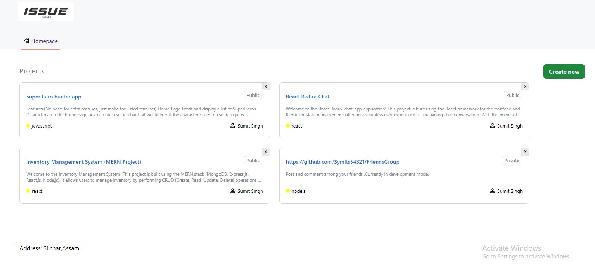
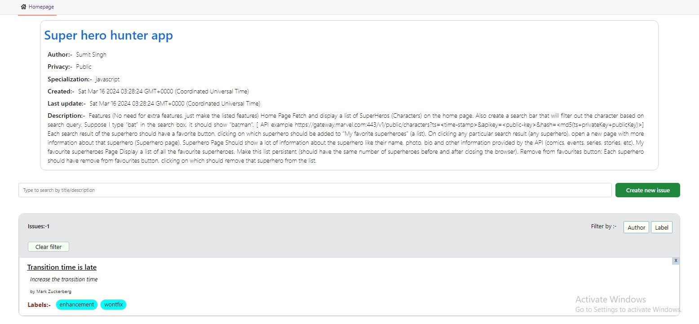
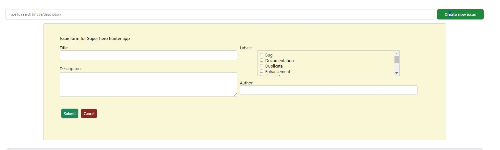
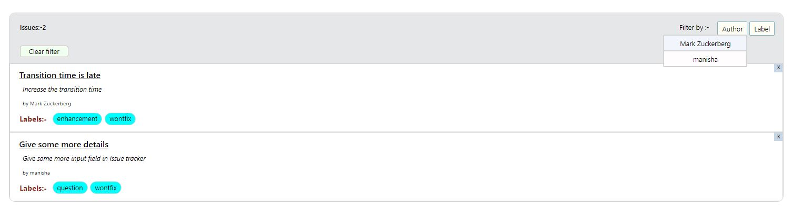
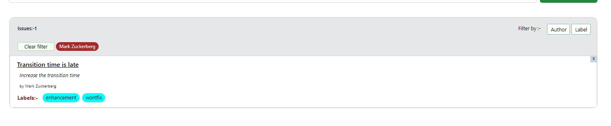

# Issue Tracker




Welcome to the Issue Tracker! This tool helps you manage projects, track issues, and collaborate effectively. Below are the instructions to create projects and report issues.

## How to Use

### Hoisted Link :-- [Click to open](https://issue-tracker-symits.onrender.com/)

### Creating Projects

To create a project, click on the create new button, please provide the following details:

1. Project Name: [Name of your project]
2. Project Description: [Description of your project]
3. Privacy:[Public,Private]
4. Specialization:[React,Javascript,CSS,HTML,......]
5. Author:[Your name or user name ]

Once you submit this information, a new project will be created and displayed as a card on the homepage.

### Managing Projects

- To view details of a project, click on the project card on the homepage.
- You will see detailed information about the project, including its description and creation time too.
- You can also create issues related to the project by clicking on the "Create Issue" button within the project details page.
  



### Creating Issues

When creating an issue, click on the "create issue" button after opening the project card and then a dropdoen will open in which you need to provide the following details:

1. Title: [Title of the issue]
2. Description: [Description of the issue]
3. Labels: [Choose from: bug, duplicate, documentation, help wanted, invalid]
4. Author: [Your name or username]
   


Your issue will be shown below 

### Filtering Issues

You can filter issues based on labels and authors on right side of issue headers. Click on the "Clear" button to reset the filters.





## Installation

To install the dependencies for this Issue Tracker app, follow these steps:

1. Make sure you have Node.js and npm installed on your machine. If not, you can download and install them from the [official Node.js website](https://nodejs.org).

2. Clone this repository to your local machine:

    ```bash
    git clone https://github.com/Symits54321/Issue-Tracker.git
    ```  

3. Navigate to the project directory:


4. Run the following command to install the required dependencies:
   

   ```bash
    npm install
    ```
   

    This will install all the necessary packages listed in the `package.json` file.

6. Once the installation is complete, you can start the application.

That's it! You have successfully installed the dependencies for the Issue Tracker app.


**Note:** Please follow the guidelines and provide accurate information when creating projects and issues. This helps streamline communication and ensures efficient collaboration.


